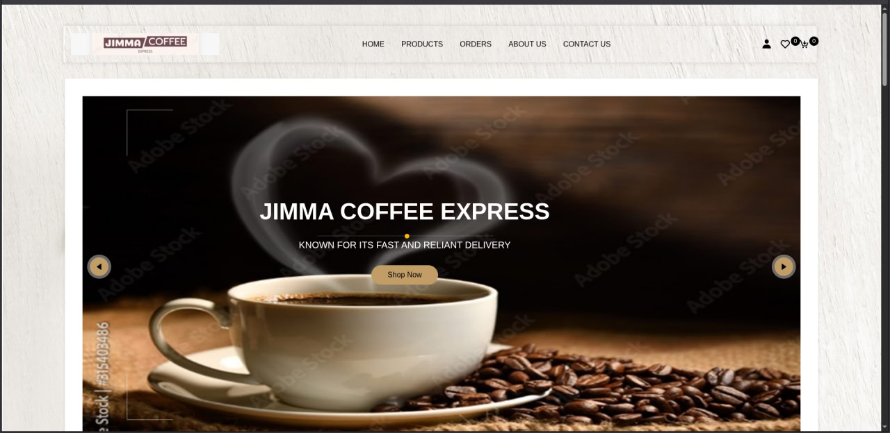
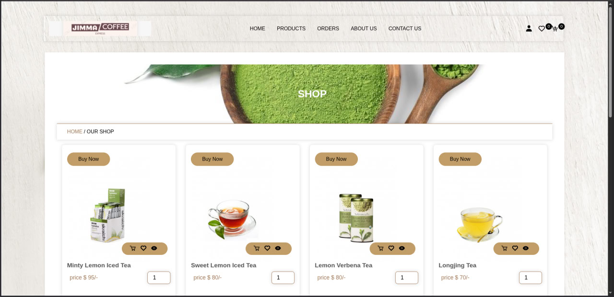
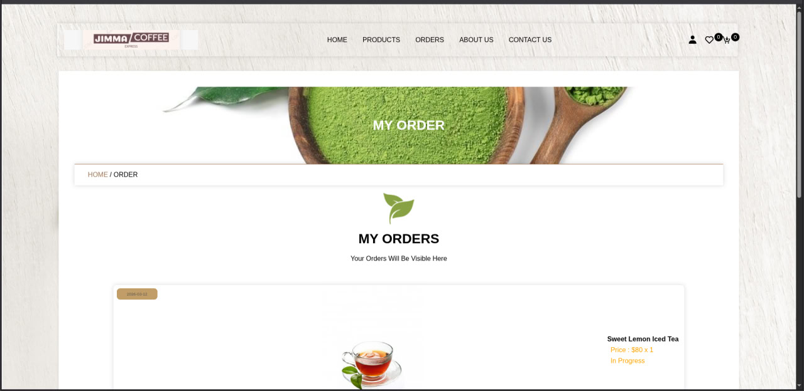

# ☕ Jimma Coffee Express

[](https://php.net)
[](https://mariadb.org)
[]()
[]()

**Jimma Coffee Express** is a high-performance, secure, and visually stunning e-commerce solution for coffee retailers. This project has been meticulously refactored from a legacy codebase into a production-ready, enterprise-grade application featuring robust security, optimized database interactions, and a premium user experience.

---

## 🖼️ Interface Preview

````carousel

<!-- slide -->

<!-- slide -->

````

---

## 🚀 Key Features

### 🛡️ Enterprise-Grade Security
- **Secure Authentication**: Passwords stored using industry-standard `bcrypt` hashing.
- **SQL Injection Prevention**: 100% PDO Prepared Statements across all modules (Storefront & Admin).
- **Session Protection**: Robust session guards for administrative areas with proper termination and validation.
- **Sanitization Pipeline**: All user inputs are sanitized and validated through a multi-layer filter system.

### 💼 Professional Architecture
- **Centralized Configuration**: Decoupled environment variables from core logic for easy staging-to-production migration.
- **Optimized Performance**: Minimized database overhead with efficient query patterns and selective fetching.
- **Unified Branding**: A consistent, premium UI with smooth micro-animations and responsive layout.

### 📦 Comprehensive Store Management
- **Dynamic Cart & Wishlist**: Real-time updates and inventory-aware logic.
- **Enterprise Checkout**: Atomic transaction logic ensures data integrity during order placement.
- **Full Admin Control**: Centralized dashboard to manage products, monitor orders, and handle user inquiries.

---

## 🛠️ Tech Stack

- **Backend**: PHP 7.4+ (Logic & API)
- **Database**: MariaDB / MySQL (Structured Data)
- **Frontend**: Vanilla CSS3, JavaScript (ES6+), SweetAlert2
- **Icons**: Boxicons Framework
- **Server**: Optimized for LAMP/LEMP stacks

---

## 📥 Installation

1. **Clone the Project**:
   ```bash
   git clone https://github.com/your-repo/jimma-coffee-express.git
   ```

2. **Server Setup**:
   - Move the contents of `store/` to your web server's document root (e.g., `/var/www/html/` or `htdocs/`).

3. **Database Migration**:
   - Create a database named `coffee` in phpMyAdmin or via CLI.
   - Import `coffee.sql` into the `coffee` database.

4. **Environment Configuration**:
   - Modify `store/components/config.php` with your production database credentials.

---

## 🌎 Deployment

For detailed production deployment instructions (including SSL setup and server hardening), please refer to the **[Enterprise Deployment Guide](store/DEPLOYMENT.md)**.

---

## 🤝 Contributing

Development is held to high architectural standards. Please ensure all new features follow the established PDO pattern and include necessary documentation.

---

## 📄 License

This project is licensed under the MIT License - see the [LICENSE](LICENSE) file for details.
